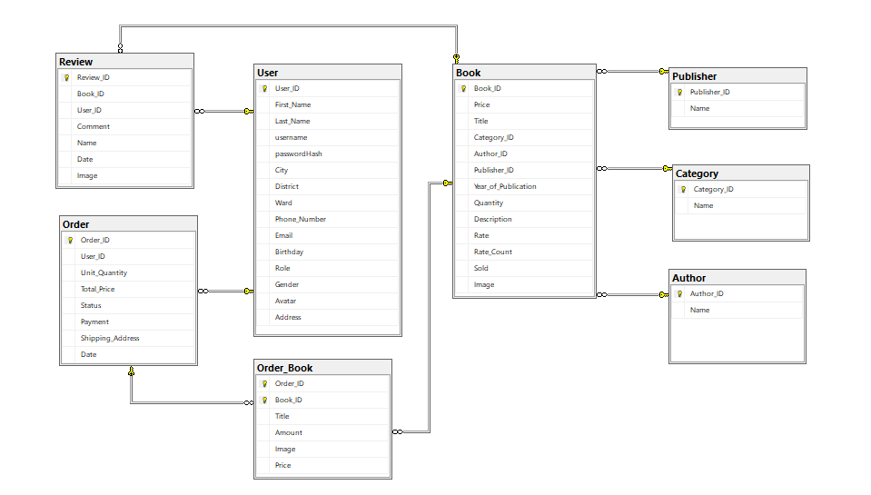

# prj301-se1849-07
## Tiệm Sách Vui Vẻ (Group 7) 
1. Đỗ Anh Tú (SE172104)
2. Phạm Duy Hoàng (SE172046)
3. Đặng Thị Ngọc Ánh (SE172088)
4. Hồ Đăng Khoa (SE172091)

# I. Requirements: 
- **Name of system:** "KATH – Online Book Store"
- **The purpose of the system:** This is a wedsite that introduces and sell books. Create a convenient and comfortable shopping experience for users, while providing complete and quality information about books.
- **Who use the system:**
   - Customer
     - Purpose: Customers use the system to search, view details, and buy books online. They can create personal accounts to track order history, store personal information, and rate books.
     - Functions: Log in/log out/register, view and search for books, add to cart, make payments, track orders and rate books.
   - Admin
     - Purpose: Seller use the system to manage books and catalogs, process orders.
     - Function: Log in/log out, manage book list, view orders, update product information.
### List all features 
### Customer
   - LOG IN/LOG OUT/REGISTER
     - Customers can log in with their registered account and log out when they are done.
   - VIEW
     - Customers can view detailed book description including author, price, and user rate...
   - SEARCH
     - Search box: customers can easily find books by entering keyword => find book name.
     - Category: Sort books into categories by genre.
     - Other search with options e.g. price, genre, publisher.
   - SHOPPING CART
     - Customers can add or remove products from cart.
     - Displays products (name, price and quantity) that have been added to the cart.
     - Display total price.
   - MAKE PAYMENT
     - Provide order information (phone number, address, ...)
     - Order confirmation.
   - REVIEW
     - Customers can rate and review books.
   - ACCOUNT MANAGEMENT
     - Customers can provide personal information and review order history.
### Admin
   - LOG IN/LOG OUT
     - Admin can log in with an seller account to access the home page with salesmanship's function and log out when they are done.
   - VIEW
     - Admin can view order list.
     - Admin can view a list of books with price, quantity sold, and quantity in stock.
   - UPDATE
     - Admin can add/ remove books.
     - Admin can update book's information.
   - ACCOUNT MANAGEMENT
     - Admin can manage customer accounts (add/delete).

# II. Wireframe or screenshots of the system
### Sitemap

###  Wireframe
- **Register**

- **Log in**

- **Log out**

- **Account Management: Profile - Order history - Shipping Address**

- **HomePage**

- **DetailPage - Review**

- **Searching**

- **Category**

- **Shopping Cart**

- **Payment**

- **Admin - Account management**

- **Admin - Order management**

- **Admin - Category add**

- **Admin - Book Controller**

# III. Database

# IV.  System design

# V. Conclusion and Discussion
   - Advantage
     - Simple, user-friendly design.
     - Can rate products, view purchase history.
     - Can log in with google, handle forgotten passwords, pagination - display products.
   - Disadvantages
     - Haven't made a filter for advanced search yet.
     - Not integrate payment methods other than COD.
     - Not use technologies such as AJAX,...
   - During developing of web application, learned
     - Apply MVC2 model to develop web application.
     - Improve programming techniques.
     - Learn new knowledge outside of the curriculum.
     - Better understand the web application development process.
     - ...
   - What would you improve your application in the future?
     - Fix the above disadvantages.
     - Fix bugs.
